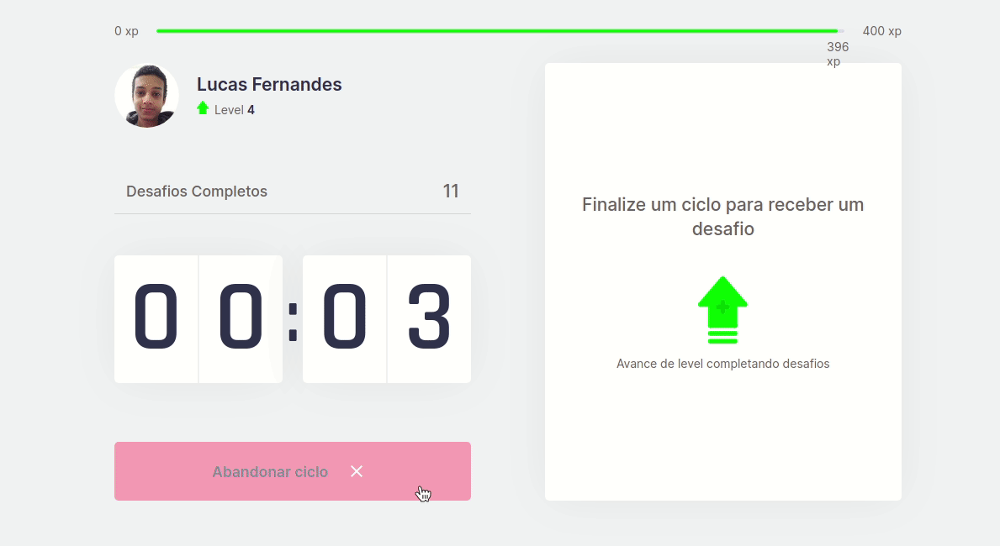
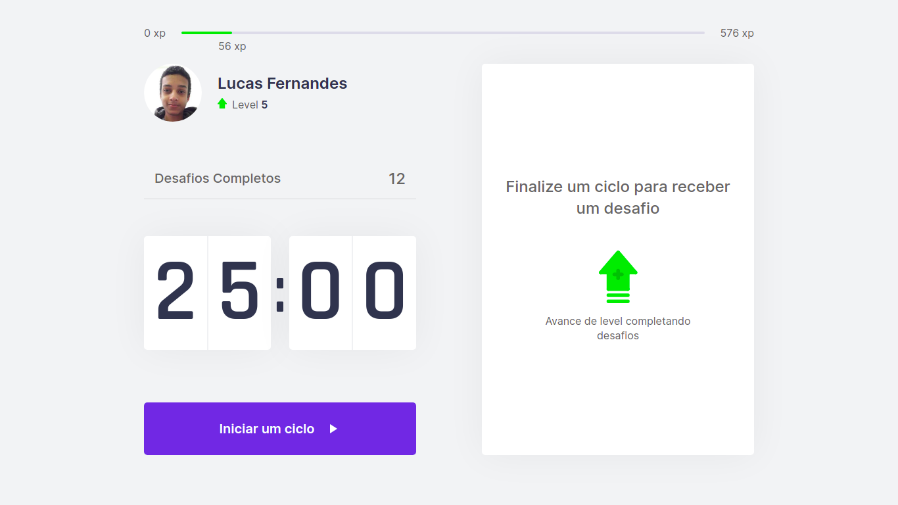
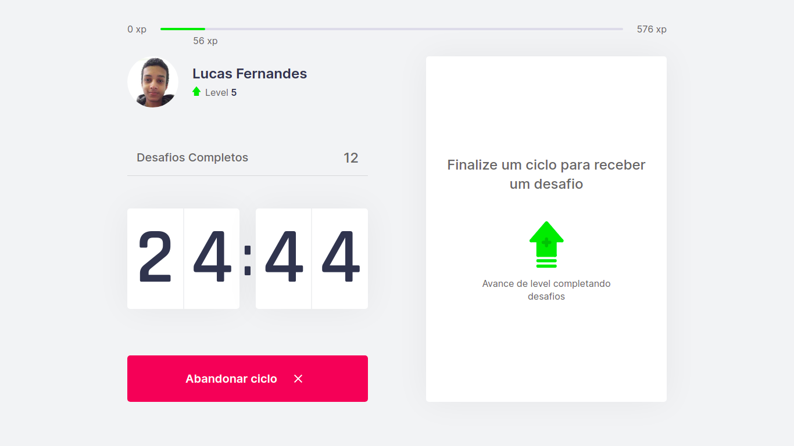

<p align="center">
  <h3 align="center">Move-it</h3>

  <p align="center">
    An app that helps time management and healthiness with the Pomodoro Technique and exercises.
    <br />
    <a href="https://github.com/lucfersan/moveit-nlw4"><strong>Explore the docs »</strong></a>
    <br />
    <br />
    ·
    <a href="https://github.com/lucfersan/moveit-nlw4/issues">Report Bug</a>
    ·
    <a href="https://github.com/lucfersan/moveit-nlw4/issues">Request Feature</a>
  </p>
</p>

## 📚 About The Project


This is an app build in the Next Level Week 4, made by [@Rocketseat](https://github.com/Rocketseat).

I chose the React track because I wanted to solidify my knowledge in this technology and learn new concepts that I can apply in my projects.

### 🛠️ Built With

- [Next.js](https://nextjs.org/)
- [React Context API](https://reactjs.org/docs/context.html)
- [Typescript](https://www.typescriptlang.org/)
- [Css](https://developer.mozilla.org/pt-BR/docs/Web/CSS)

### 💻 Installation

1. Clone the repo
   ```sh
   git clone https://github.com/lucfersan/moveit-nlw4.git
   ```
2. Install the packages
   ```sh
   cd moveit-nlw4
   yarn
   ```

### 🚀 Run locally

1. Start the server
   ```sh
   yarn dev
   ```
2. Open your browser on localhost:3000

## 🎮 Usage

<p float="left">
  
   
</p>

## 🤝 Contributing

Contributions are what make the open source community such an amazing place to be learn, inspire, and create. Any contributions you make are **greatly appreciated**.

1. Fork the Project
2. Create your Feature Branch (`git checkout -b feature/AmazingFeature`)
3. Commit your Changes (`git commit -m 'Add some AmazingFeature'`)
4. Push to the Branch (`git push origin feature/AmazingFeature`)
5. Open a Pull Request

## 🗞️ License

Distributed under the MIT License. See `LICENSE` for more information.

## 📬 Contact

Lucas Fernandes - fernandes.lucas11@outlook.com

Project Link: [https://moveit-next-lucas.vercel.app/](https://moveit-next-lucas.vercel.app/)

### 😄 Special thanks to

- [Diego Fernandes](https://github.com/diego3g)
- [Rocketseat](https://github.com/Rocketseat)
